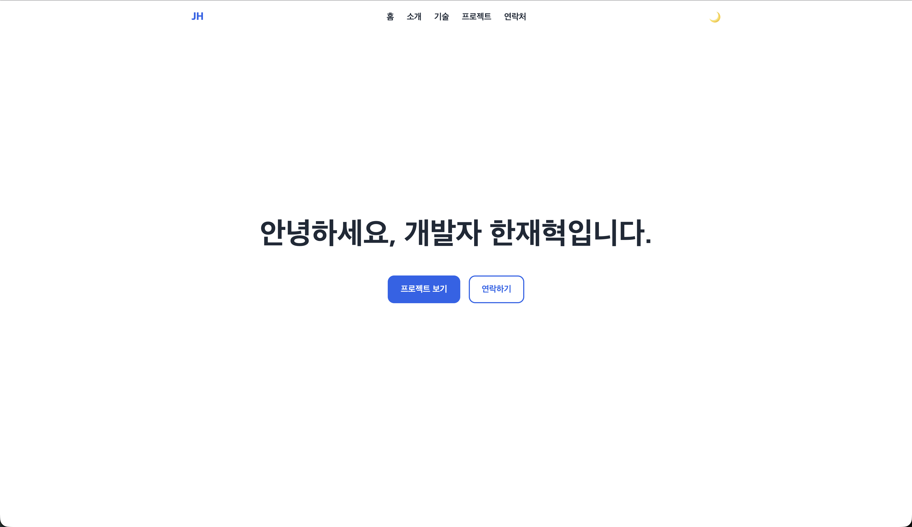
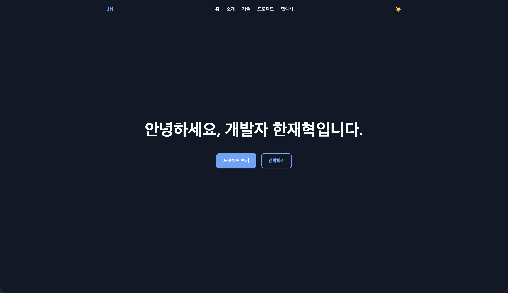
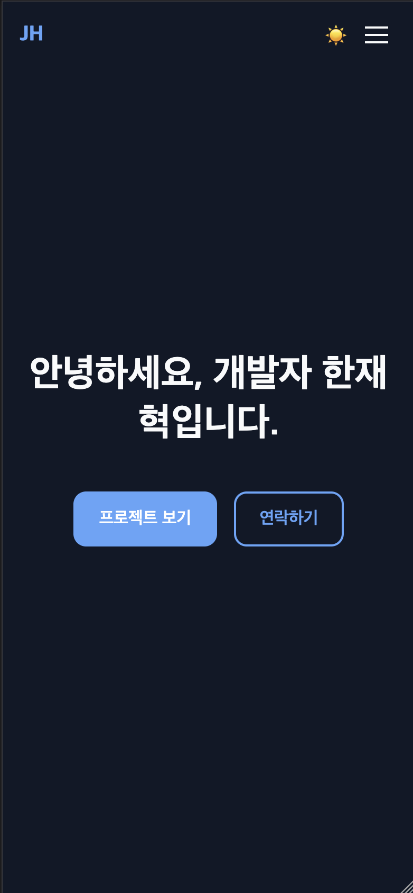

# 나를 소개하는 웹페이지

순수 HTML, CSS, JavaScript만으로 만든 반응형 포트폴리오 웹사이트입니다.
"사용자 이벤트 → 상태 변경 → 화면 업데이트" 흐름을 이해하는 것을 목표로,
프레임워크·라이브러리 없이 처음부터 직접 구현했습니다.

## 🔗 배포 주소

**https://deliolleh.github.io/Codyssey_tool_B1-1/**

## 사용 기술

- **HTML5** — 시맨틱 마크업 (`header` / `nav` / `main` / `section` / `article` / `footer`)
- **CSS3** — 용도 기반 CSS 변수, Flexbox(네비게이션)·Grid(카드 목록), 모바일 퍼스트 반응형
- **JavaScript (ES6+)** — DOM·이벤트, `fetch` + `async/await`, Intersection Observer, localStorage

## 주요 기능

| 기능 | 구현 방식 |
|---|---|
| 반응형 레이아웃 | 모바일 퍼스트, 브레이크포인트 768px(태블릿) / 1024px(데스크톱) |
| 모바일 메뉴 | 햄버거 버튼 → 풀스크린 오버레이 토글 |
| 부드러운 스크롤 | CSS `scroll-behavior: smooth` (동작 줄이기 설정 사용자는 제외) |
| 스크롤 탑 버튼 | 스크롤 위치 감지 후 표시, 클릭 시 최상단 이동 |
| 헤더 배경 전환 | 상단에서는 투명, 스크롤 시 배경·그림자 표시 |
| 섹션 등장 애니메이션 | Intersection Observer, 재진입 시 반복 재생 |
| 다크 모드 | 토글 → `data-theme` 속성 → CSS 변수 재정의. localStorage 저장, 시스템 설정(prefers-color-scheme) 감지, head 부트스트랩으로 첫 페인트 깜빡임 방지 |
| 폼 유효성 검증 | blur 시 검사 + 에러 필드만 입력 중 재검증 + 제출 시 전체 검사. 이메일 형식은 `checkValidity()` 위임 |
| GitHub API 연동 | `fetch`+`async/await`로 저장소 목록 로드. 로딩/성공/에러/빈 4가지 상태 UI, 에러 원인별 안내(403 한도·404·네트워크), 재시도 버튼(이벤트 위임) |

## 상태 관리 흐름 (이벤트 → 상태 → 렌더링)

1. **다크 모드**: 토글 클릭 → `currentTheme` 변경 → `renderTheme()`이 DOM 반영
2. **GitHub API**: 호출 → `projectsState`(loading/success/error/empty) 전환 → `renderProjects()`가 화면 생성
3. **폼 검증**: 입력/제출 → 유효성 판정(`getErrorMessage`) → 에러 그릇 표시/숨김(`renderFieldError`)

## 동작 기준값 (변경 시 이 표를 갱신)

| 항목 | 값 |
|---|---|
| 스크롤 탑 버튼 표시 | 스크롤 300px 초과 |
| 헤더 배경 전환 | 스크롤 60px 초과 |
| Intersection Observer threshold | 0.2 |

## 폴더 구조

```
├── index.html      # 메인 페이지 (head에 테마 부트스트랩 포함)
├── css/style.css   # 스타일시트 (CSS 변수 + 다크 테마 + 반응형)
├── js/main.js      # 인터랙션·검증·API 스크립트
└── images/         # 이미지
```

## 스크린샷

| 데스크톱 (라이트) | 다크 모드 |
|---|---|
|  |  |

| 모바일 |
|---|
|  |

## 로컬 실행

저장소를 클론한 뒤 VS Code의 Live Server 등 정적 서버로 `index.html`을 열면 됩니다.
GitHub API는 무인증 호출(시간당 60회 제한)이므로 짧은 시간에 반복 새로고침하면
403 안내가 표시될 수 있습니다 — 잠시 후 "다시 시도"를 누르면 됩니다.
